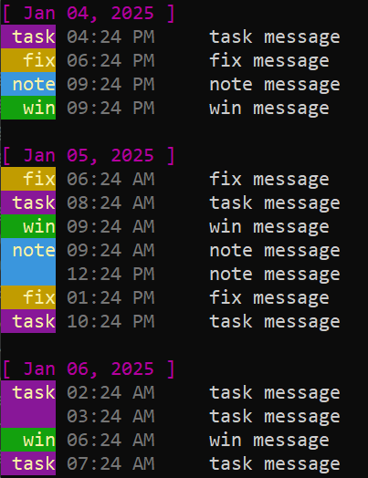
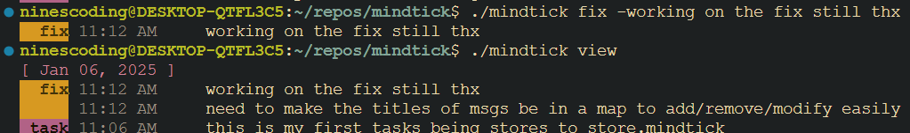

## About

Mindtick is a lightweight CLI tool designed to help you track your progress, tasks, and accomplishments in a structured, timestamped log. With Mindtick, you can easily log your wins, notes, fixes, and tasks to maintain a clear and organized timeline of your work.

All data is stored in a SQLite database file named `store.mindtick`, which is created in your current directory when you run `mindtick new`. This file acts as a portable and self-contained activity log, ensuring your thoughts and progress are always consolidated and easy to manage.

Each entry in the `store.mindtick` file is recorded with:
- A **timestamp** (automatically generated).
- A **message type** (`win`, `note`, `fix`, `task`).
- The **message content** you provide.

When you run a `mindtick` command, the tool searches for the `store.mindtick` file starting from your current directory and traversing up the directory tree. This means that you can use Mindtick from any subdirectory of your project, and the tool will always find and operate on the nearest `store.mindtick` file.

NOTE: The ANSI colors only work in terminals that support it, if you were to use this with Windows Powershell or Command Prompt you will see the ANSI escape codes as plaintext. So I recommend to not do this on windows or use another terminal! (Works great in the integrated vscode terminal on all OS's)

## Installation

Make sure you have the most recent version of go installed *(1.24.4 at the time of writing)*

You can find the most recent release of go here: https://go.dev/dl/

After go has been installed, run `go install github.com/ninesl/mindtick@latest`

If your `$PATH` variables are setup correctly *(will be by default)* run `mindtick` in a new terminal window to ensure Mindtick was installed correctly.

## Why make this instead of a todo.txt?

I made this project because I have been having difficulties when I'm explaining to my non-technical clients what I've been working on.

This is really helpful for me to get an overview of my progress/what I've been doing in a project because of the timestamps on each message being sent to Mindtick. 

While `todo.txt` is extremely simple for task tracking, this tool is more personal and thought-driven. I think of it as a changelog for your mind. It's not just about tasks, it's about documenting your mental journey. Just remember to use it consistently!

## Suggested Use

run `mindtick new` to create a new `store.mindtick` in your project's root directory. If a `.gitignore` file is found, `store.mindtick` gets appended to `.gitignore`

## Commands

### Usage: `mindtick <command>`

| Command   | Description                                         |
|-----------|-----------------------------------------------------|
| `help`    | Display this help message.                         |
| `new`     | Create a new `store.mindtick` file in the current directory. |
| `delete`  | Delete the `store.mindtick` file in the current directory. |
| `view`    | Display all messages in the current `store.mindtick` file. |
| `win`     | Add a win message: `mindtick win -<message>`.      |
| `note`    | Add a note message: `mindtick note -<message>`.    |
| `fix`     | Add a fix message: `mindtick fix -<message>`.      |
| `task`    | Add a task message: `mindtick task -<message>`.    |

## Examples

The output after running `mindtick view`

Adding a message to your current `store.mindtick`

`mindtick win -your message goes here`

| Planned Features                              |                                                |
|--------------------------------------|------------------------------------------------------------|
| `search {tags}`                      | Display messages filtered by specific tags.                |
| `export {tags} {filetype}`           | Export messages to `.pdf`, `.csv`, or `.txt` based on tags. |
| `delete <id>`                        | Delete a specific message by its unique ID.                |
| `edit <id> <new message>`            | Edit an existing message by its ID.                        |
| `filter {tags}`                      | Filter messages in various commands by tags.               |
| `{win, note, fix, task}`             | Filter messages by type (win, note, fix, task).            |
| `{keyword}`                          | Search messages by a specific keyword or substring.        |
| `{today, yesterday, week, YYYY-MM-DD}` | Filter messages by date ranges.                           |

I also am planning on implementing user-created tags and the ability to turn off color codes (for terminals that can't render it)
