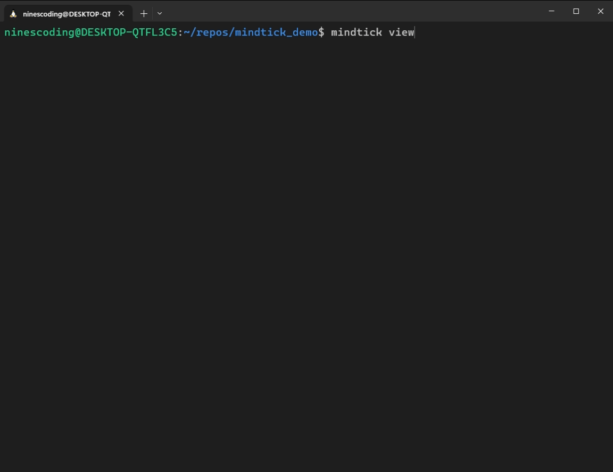

## About

Mindtick is a lightweight CLI tool designed to help you track your progress, tasks, and accomplishments in a structured, timestamped log. With Mindtick, you can easily log your wins, notes, fixes, and tasks to maintain a clear and organized timeline of your work.

All data is stored in a SQLite database file named `store.mindtick`, which is created in your current directory when you run `mindtick new`. This file acts as a portable and self-contained activity log, ensuring your thoughts and progress are always consolidated and easy to manage.

Each entry in the `store.mindtick` file is recorded with:
- A **timestamp** (automatically generated).
- A **message type** (`mindtick tags` to see all available tags).
- The **message content** you provide.

When you run a `mindtick` command, the tool searches for the `store.mindtick` file starting from your current directory and traversing up the directory tree. This means that you can use Mindtick from any subdirectory of your project, and the tool will always find and operate on the nearest `store.mindtick` file.

NOTE: The ANSI colors only work in terminals that support it, if you were to use this with Windows Powershell or Command Prompt you will see the ANSI escape codes as plaintext. So I recommend to not do this on windows or use another terminal! (Works great in the integrated vscode terminal on all OS's)

## Examples
Basic usage:
```bash
mindtick win -finally fixed that nasty bug
mindtick note -remember to update dependencies
mindtick view week          # show all messages from last 7 days
mindtick view task month    # show only tasks from the last month
mindtick view yesterday fix # show only fixes since yesterday - notice how the order doesn't matter
mindtick view win           # show only win messages
```

Demonstration of sub directory behavior:

Note how you can access the parent `store.mindtick` in a sub directory  
and how having multiple `store.mindtick` files work in a folder structure.


<!-- {: width="200"} -->


Example initializing and writing a `win` message

<!-- {: width="600"} -->


Example usages of `mindtick view`

<!-- {: width="600"} -->


`mindtick tags`

<!-- {: width="600"} -->


## Installation

Make sure you have the most recent version of go installed *(1.23.4 at the time of writing)*

You can find the most recent release of go here: https://go.dev/dl/

After go has been installed, run `go install github.com/ninesl/mindtick@latest`

If your `$PATH` variables are setup correctly *(will be by default)* run `mindtick` in a new terminal window to ensure Mindtick was installed correctly.

## Why make this instead of a todo.txt?

I made this project because I have been having difficulties when I'm explaining to my non-technical clients what I've been working on.

This is really helpful for me to get an overview of my progress/what I've been doing in a project because of the timestamps on each message being sent to Mindtick. 

While `todo.txt` is extremely simple for task tracking, this tool is more personal and thought-driven. I think of it as a changelog for your mind. It's not just about tasks, it's about documenting your mental journey. Just remember to use it consistently!

## Suggested Use

run `mindtick new` to create a new `store.mindtick` in your project's root directory. If a `.gitignore` file is found, `store.mindtick` gets appended to `.gitignore`


## Commands

### Usage: `mindtick command args`

| Command   | Description                                         |
|-----------|-----------------------------------------------------|
| `help`    | Display this help message.                         |
| `version` | Display the current version of mindtick            |
| `new`     | Create a new `store.mindtick` file in the current directory. |
| `delete`  | Delete the `store.mindtick` file in the current directory. |
| `view`    | Display all messages in current `store.mindtick`   |
| `view [tag]` | Display messages filtered by tag type           |
| `view [range]` | Display messages filtered by time range       |
| `view [tag] [range]` | Display messages filtered by both tag and range |
| `view [range] [tag]` | Display messages filtered by both tag and range |
| `[tag]`     | Add a win message: `mindtick tag -your message`. |
| `tags`    | Display all available tags and usage information   |
| `ranges`  | Display all available time range options           |

### Tags
Run `mindtick tags` to see all available tags for creating new messages or filtering:


### Time Ranges
Available time ranges for filtering:
- `today` - Show messages from today only
- `yesterday` - Show messages from yesterday
- `week` - Show messages from the last 7 days
- `month` - Show messages from the last month


| Planned Features                              |                                                |
|--------------------------------------|------------------------------------------------------------|
| `export {tags} {filetype}`           | Export messages to `.pdf`, `.csv`, or `.txt` based on tags. |
| `delete <id>`                        | Delete a specific message by its unique ID.                |
| `edit <id> <new message>`            | Edit an existing message by its ID.                        |
| `{keyword}`                          | Filter messages by a specific keyword or substring.        |
| `{YYYY-MM-DD}` | Filter messages by date.                           |
| `global` | Have a system-wide mindtick thats stored with the binary |
| `custom tags`| Have custom tags and colors. Custom config stored in the global `store.mindtick` |